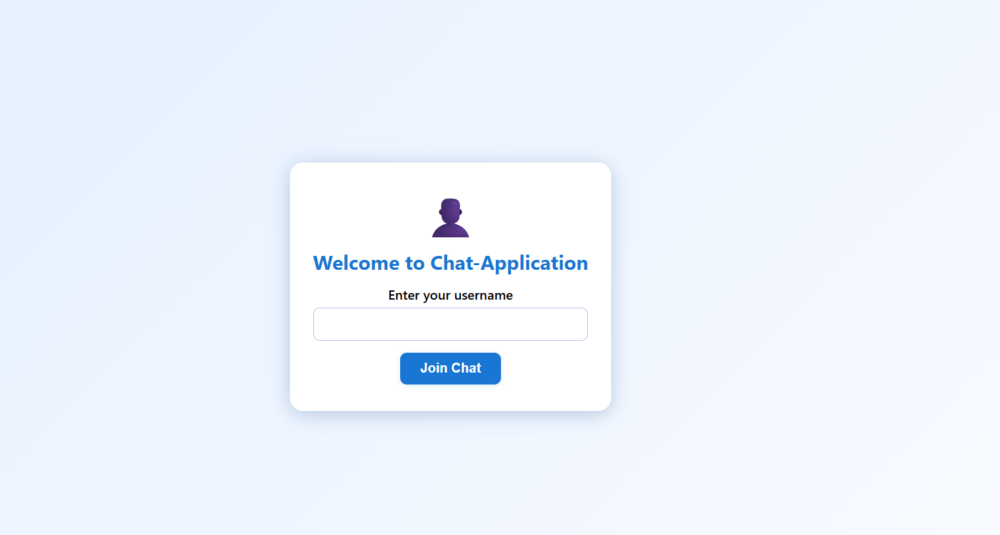

This project is a real-time chat application built using React for the frontend and Node.js with Express for the backend. It leverages WebSockets for seamless, bidirectional communication and MongoDB for persistent message storage. This application was developed as part of the technical assignment for Kuvaka Tech.

**Functionality:**

*   **Real-Time Messaging:** Users can exchange messages instantly.
*   **User Authentication:** Simple username-based login to identify users.
*   **Message History:** Retains the last 50 chat messages, providing a sense of continuity.
*   **Responsive Design:** Provides a good experience across various devices.
*   **MongoDB Integration:** stores all the messages in database

## Screenshots

Here's a glimpse of the application's interface:

**Login Screen:**



**Chat Window:**


## Technologies Used

*   **Frontend:**
    *   React: A JavaScript library for building user interfaces.
    *   Create React App: A tool for setting up a modern React development environment.
    *   WebSockets: For real-time communication.
*   **Backend:**
    *   Node.js: A JavaScript runtime environment.
    *   Express: A web application framework for Node.js.
    *   MongoDB: A NoSQL database for storing chat messages.
    *   Mongoose: An Object Data Modeling (ODM) library for MongoDB and Node.js


Generated code
*   `backend/`: Contains the Node.js/Express server code, including models and routes.
*   `frontend/`: Contains the React application code, including components and styles.
*   `public/`: static assets like html , png image.
*   `src/`: Source files for app components
*   `components/`: Reusable components for the Chat App

## Setup Instructions

Follow these steps to run the application locally:

1.  **Clone the repository:**

    ```bash
    git clone https://github.com/Jayesh-2404/Kuvaka-Tech-Assignment.git
    cd jayesh-2404-kuvaka-tech-assignment
    ```

2.  **Backend Setup:**

    ```bash
    cd backend
    npm install  
    ```

    *   Create a `.env` file in the `backend/` directory with the following environment variable:

        ```
        MONGO_URI=<your_mongodb_connection_string>
        PORT=5000 #optional
        ```

    *   Start the backend server:

        ```bash
        npm start
        ```

        The server will be running on port 5000 (or the port specified in your `.env` file).

3.  **Frontend Setup:**

    ```bash
    cd ../frontend
    npm install  
    ```

    *   Start the frontend development server:

        ```bash
        npm start
        ```

        The frontend will be running at `http://localhost:3000`.

## Deployment

The application is designed to be easily deployed to platforms like Render or Vercel. Here's the configuration you'll need:

**Backend (Render):**

*   **Repository:** Connect your Render account to your Git repository.
*   **Build Command:** `npm install`
*   **Start Command:** `node server.js`
*   **Environment Variables:** Set the `MONGO_URI` environment variable in Render's settings.


## WebSocket API

*   `wss://<your-backend-url>`:  The WebSocket endpoint for real-time communication.

    *   **Incoming Messages (Client -> Server):**
        *   `{ type: 'set_username', username: string }`: Sets the username for the client connection.
        *   `{ type: 'chat_message', message: string }`: Sends a new chat message.
    *   **Outgoing Messages (Server -> Client):**
        *   `{ type: 'history', messages: Array<Message> }`: Sends the initial chat history.  `Message` objects have the format: `{ username: string, message: string, timestamp: number }`.
        *   `{ type: 'chat_message', username: string, message: string, timestamp: number }`: Broadcasts a new chat message.
        *   `{ type: 'error', message: string }`: Sends an error message to the client.

